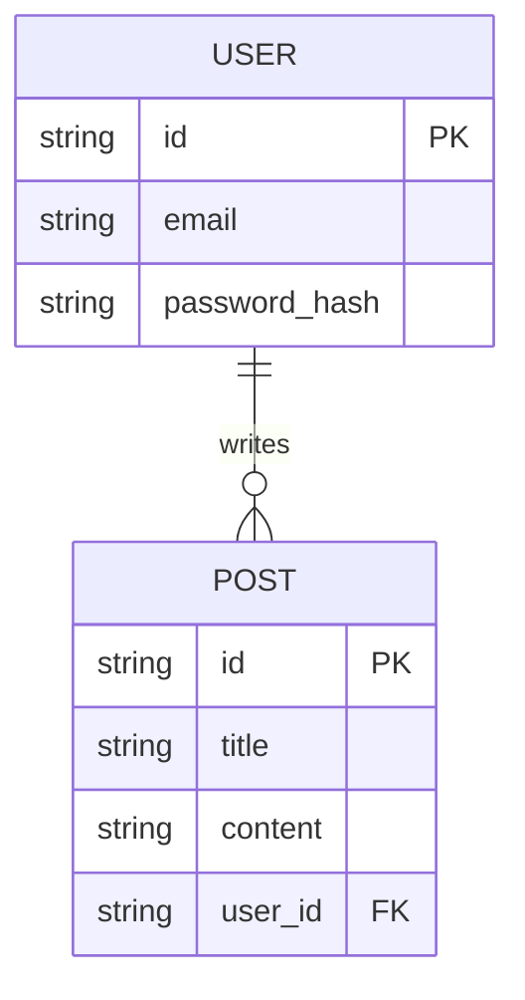

# 🏗️ 시스템 아키텍처 설계 (Expanded)

## 📐 기술 스택 상세 (Technology Stack)
- **Frontend**: Nuxt 3 (SSR 지원) + Tailwind CSS + Pinia
- **Backend**: FastAPI + SQLAlchemy (Async)
- **Database**: PostgreSQL (Store) + Redis (Cache/Session)
- **Environment**: Docker Compose (Local) → K8s (Prod)

## 💾 데이터베이스 스키마 설계 (ERD)

## 🌐 API 인터페이스 정의
- **Base URL**: `/api/v1`
- **Endpoints**:
  - `POST /auth/login`: 인증 및 토큰 발행
  - `GET /posts`: 게시글 목록 조회 (페이징 필수)
  - `POST /posts`: 신규 게시글 작성

## 🚀 전략적 결정
- **인증**: OAuth2 + JWT (Stateful Session 비권장)
- **비동기 처리**: 이메일 발송 등은 Celery + RabbitMQ 처리

**출력 파일**: `docs/architecture.md`에 상세 내용을 기록하세요.
**다음**: `coder` 스킬을 호출하여 프로젝트 구조를 생성하세요.
