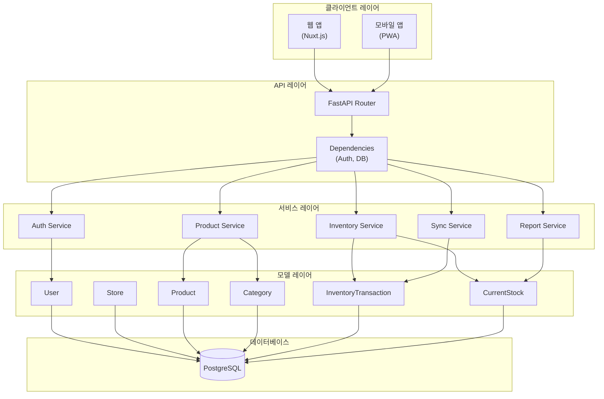
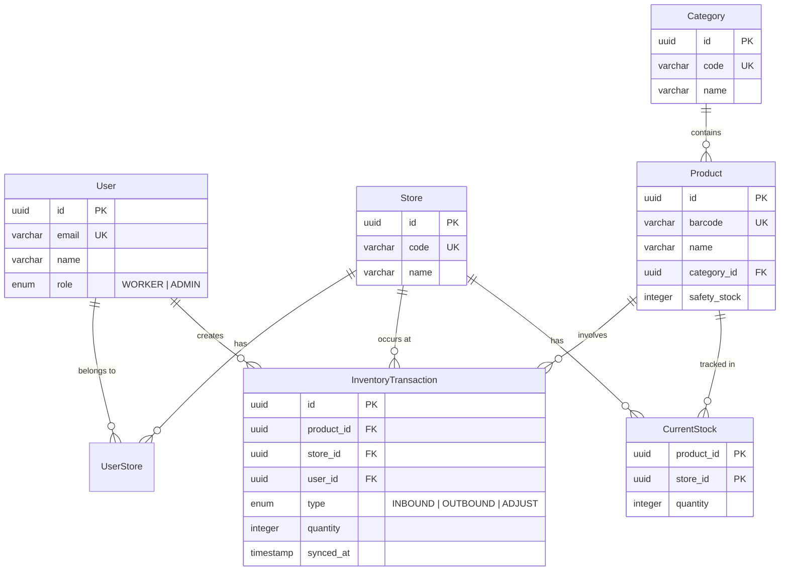
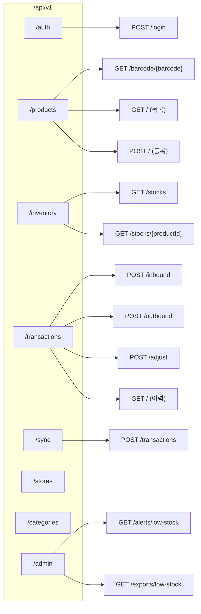

# 시스템 아키텍처 개요

## 레이어 구조

```mermaid
flowchart TB
    subgraph Client["클라이언트 레이어"]
        Web["웹 앱<br/>(Nuxt.js)"]
        Mobile["모바일 앱<br/>(PWA)"]
    end
    
    subgraph API["API 레이어"]
        Router["FastAPI Router"]
        Deps["Dependencies<br/>(Auth, DB)"]
    end
    
    subgraph Service["서비스 레이어"]
        AuthSvc["Auth Service"]
        ProductSvc["Product Service"]
        InventorySvc["Inventory Service"]
        SyncSvc["Sync Service"]
        ReportSvc["Report Service"]
    end
    
    subgraph Model["모델 레이어"]
        User["User"]
        Store["Store"]
        Product["Product"]
        Category["Category"]
        Transaction["InventoryTransaction"]
        Stock["CurrentStock"]
    end
    
    subgraph DB["데이터베이스"]
        PostgreSQL[(PostgreSQL)]
    end
    
    Web --> Router
    Mobile --> Router
    Router --> Deps
    Deps --> AuthSvc
    Deps --> ProductSvc
    Deps --> InventorySvc
    Deps --> SyncSvc
    Deps --> ReportSvc
    
    AuthSvc --> User
    ProductSvc --> Product
    ProductSvc --> Category
    InventorySvc --> Transaction
    InventorySvc --> Stock
    SyncSvc --> Transaction
    ReportSvc --> Stock
    
    User --> PostgreSQL
    Store --> PostgreSQL
    Product --> PostgreSQL
    Category --> PostgreSQL
    Transaction --> PostgreSQL
    Stock --> PostgreSQL
```

---

## 도메인 관계도

```mermaid
erDiagram
    User ||--o{ UserStore : "belongs to"
    Store ||--o{ UserStore : "has"
    User ||--o{ InventoryTransaction : "creates"
    Store ||--o{ InventoryTransaction : "occurs at"
    Store ||--o{ CurrentStock : "has"
    Category ||--o{ Product : "contains"
    Product ||--o{ InventoryTransaction : "involves"
    Product ||--o{ CurrentStock : "tracked in"

    User {
        uuid id PK
        varchar email UK
        varchar name
        enum role "WORKER | ADMIN"
    }

    Store {
        uuid id PK
        varchar code UK
        varchar name
    }

    Category {
        uuid id PK
        varchar code UK
        varchar name
    }

    Product {
        uuid id PK
        varchar barcode UK
        varchar name
        uuid category_id FK
        integer safety_stock
    }

    InventoryTransaction {
        uuid id PK
        uuid product_id FK
        uuid store_id FK
        uuid user_id FK
        enum type "INBOUND | OUTBOUND | ADJUST"
        integer quantity
        timestamp synced_at
    }

    CurrentStock {
        uuid product_id PK
        uuid store_id PK
        integer quantity
    }
```

---

## API 라우트 구조

```mermaid
graph LR
    subgraph V1["/api/v1"]
        Auth["/auth"]
        Products["/products"]
        Inventory["/inventory"]
        Transactions["/transactions"]
        Sync["/sync"]
        Stores["/stores"]
        Categories["/categories"]
        Admin["/admin"]
    end
    
    Auth --> Login["POST /login"]
    
    Products --> P1["GET /barcode/{barcode}"]
    Products --> P2["GET / (목록)"]
    Products --> P3["POST / (등록)"]
    
    Inventory --> I1["GET /stocks"]
    Inventory --> I2["GET /stocks/{productId}"]
    
    Transactions --> T1["POST /inbound"]
    Transactions --> T2["POST /outbound"]
    Transactions --> T3["POST /adjust"]
    Transactions --> T4["GET / (이력)"]
    
    Sync --> S1["POST /transactions"]
    
    Admin --> A1["GET /alerts/low-stock"]
    Admin --> A2["GET /exports/low-stock"]
```
