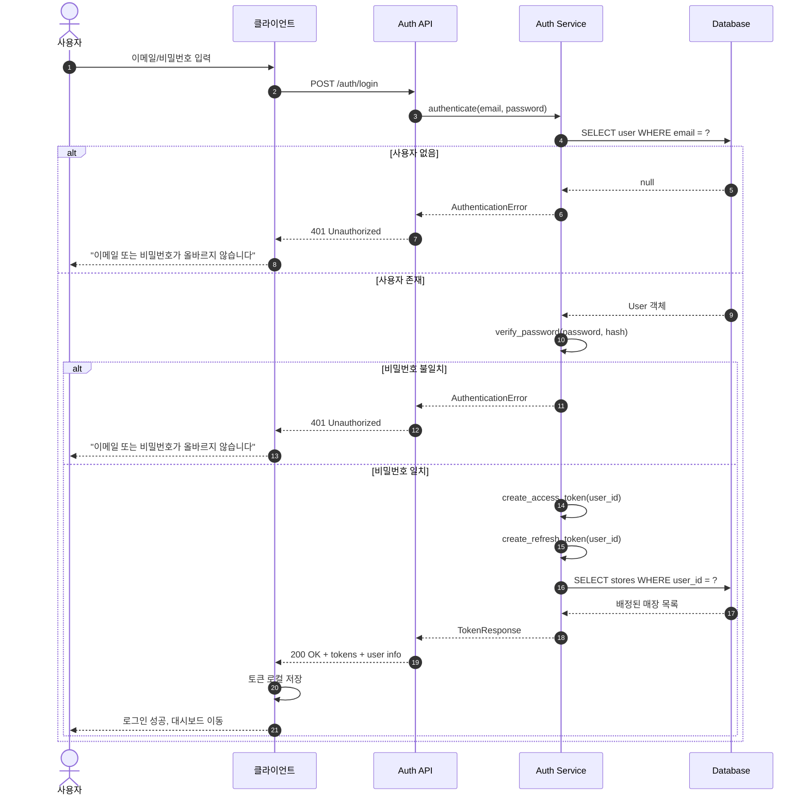
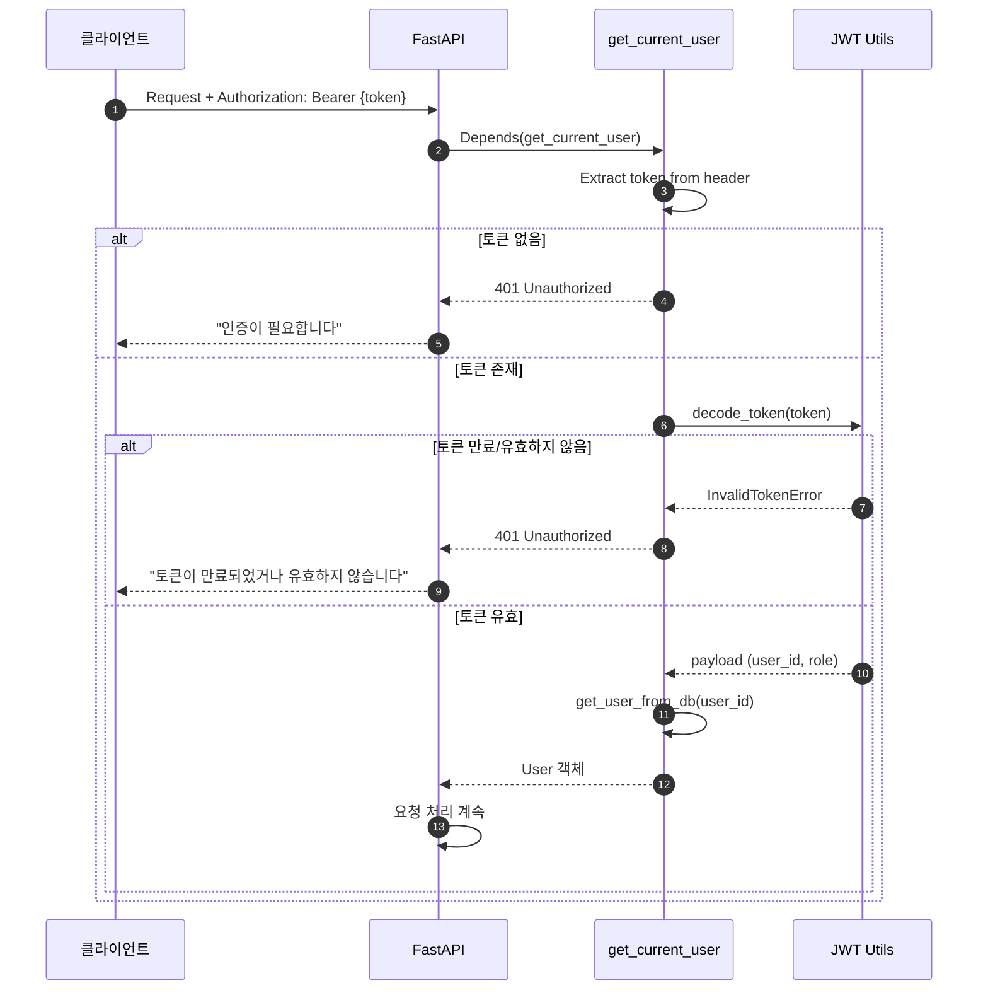
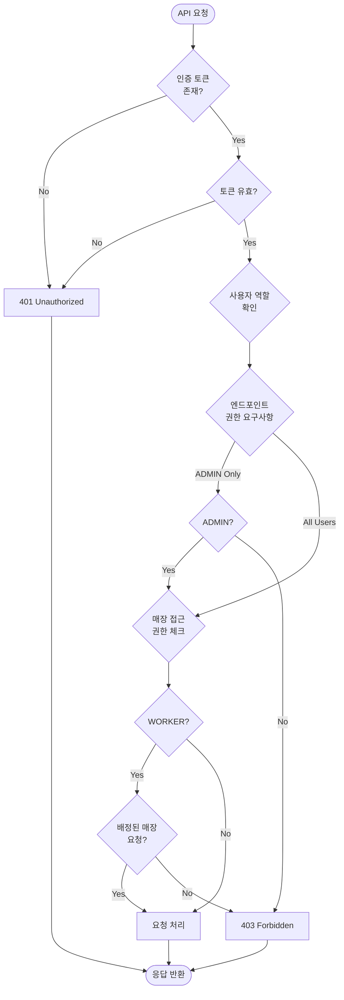

# 인증 (Auth) 플로우

## 로그인 시퀀스

---

## JWT 토큰 검증 플로우

---

## 권한 체크 플로우차트

---

## 역할별 기능 매트릭스

| 기능 | WORKER | ADMIN |
|------|--------|-------|
| 로그인 | ✅ | ✅ |
| 배정 매장 재고 조회 | ✅ | ✅ |
| 전체 매장 재고 조회 | ❌ | ✅ |
| 입고/출고/조정 처리 | ✅ (배정 매장) | ✅ (전체) |
| 신규 제품 등록 | ❌ | ✅ |
| 안전재고 알림 조회 | ❌ | ✅ |
| 엑셀 내보내기 | ❌ | ✅ |
