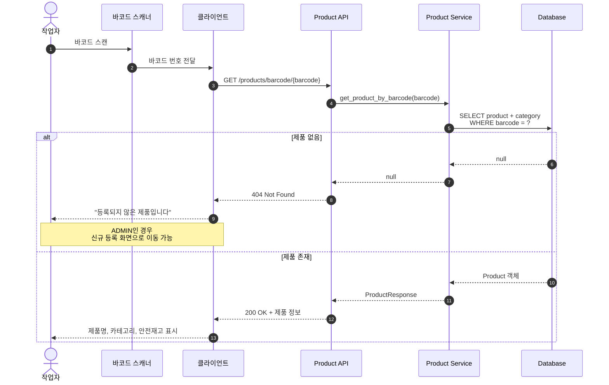
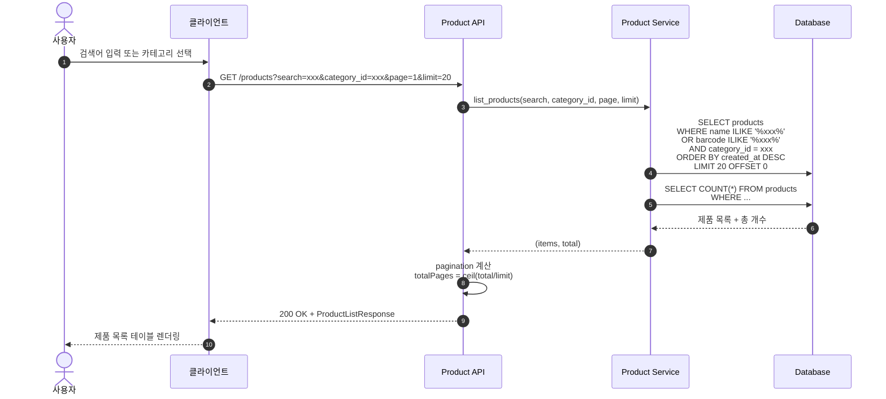
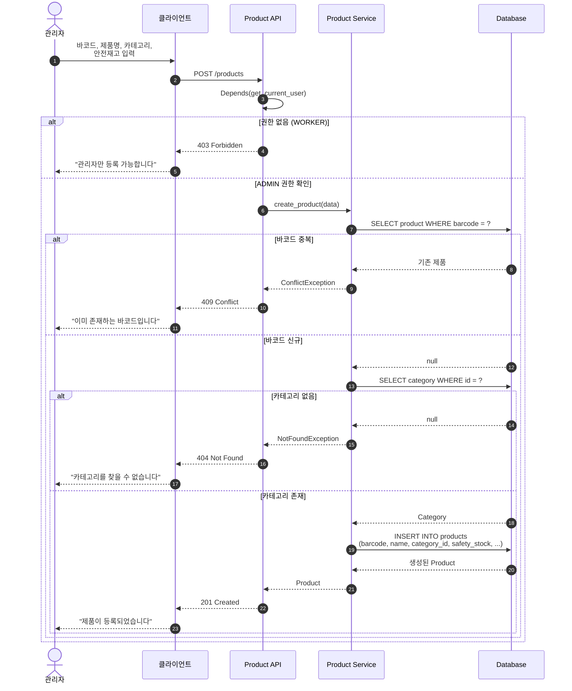
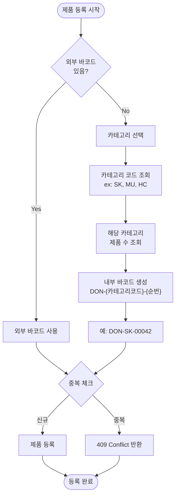

# 제품 (Product) 플로우

## 바코드 스캔 제품 조회

---

## 제품 목록 조회 (검색/필터)

---

## 신규 제품 등록 (ADMIN Only)

---

## 내부 바코드 생성 플로우

바코드가 없는 제품의 경우 내부 바코드를 자동 생성합니다.

---

## 제품 관련 테이블 구조

| 컬럼 | 타입 | 설명 |
|------|------|------|
| `id` | UUID | 고유 식별자 |
| `barcode` | VARCHAR(50) | 바코드 (유니크) |
| `name` | VARCHAR(200) | 제품명 |
| `category_id` | UUID FK | 카테고리 |
| `safety_stock` | INTEGER | 안전재고 임계값 |
| `image_url` | VARCHAR(500) | 제품 이미지 |
| `memo` | TEXT | 메모 |
| `is_active` | BOOLEAN | 활성화 여부 |
