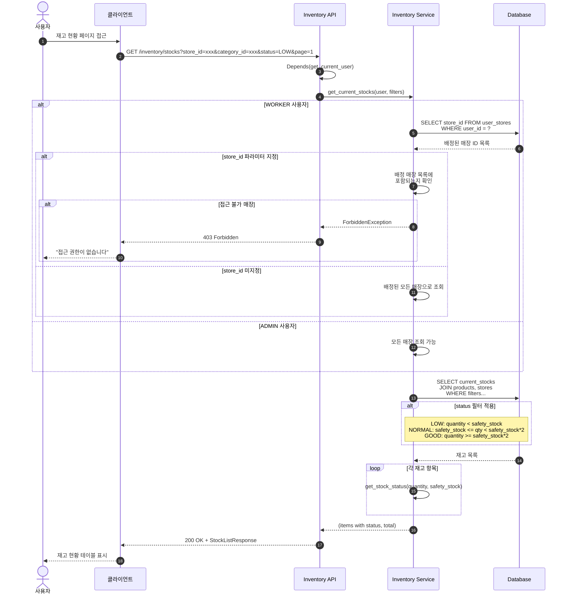
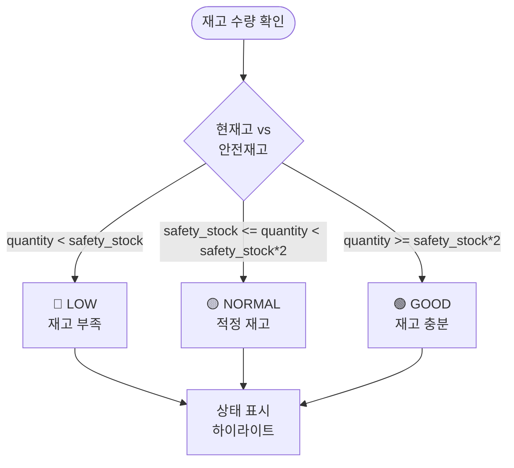
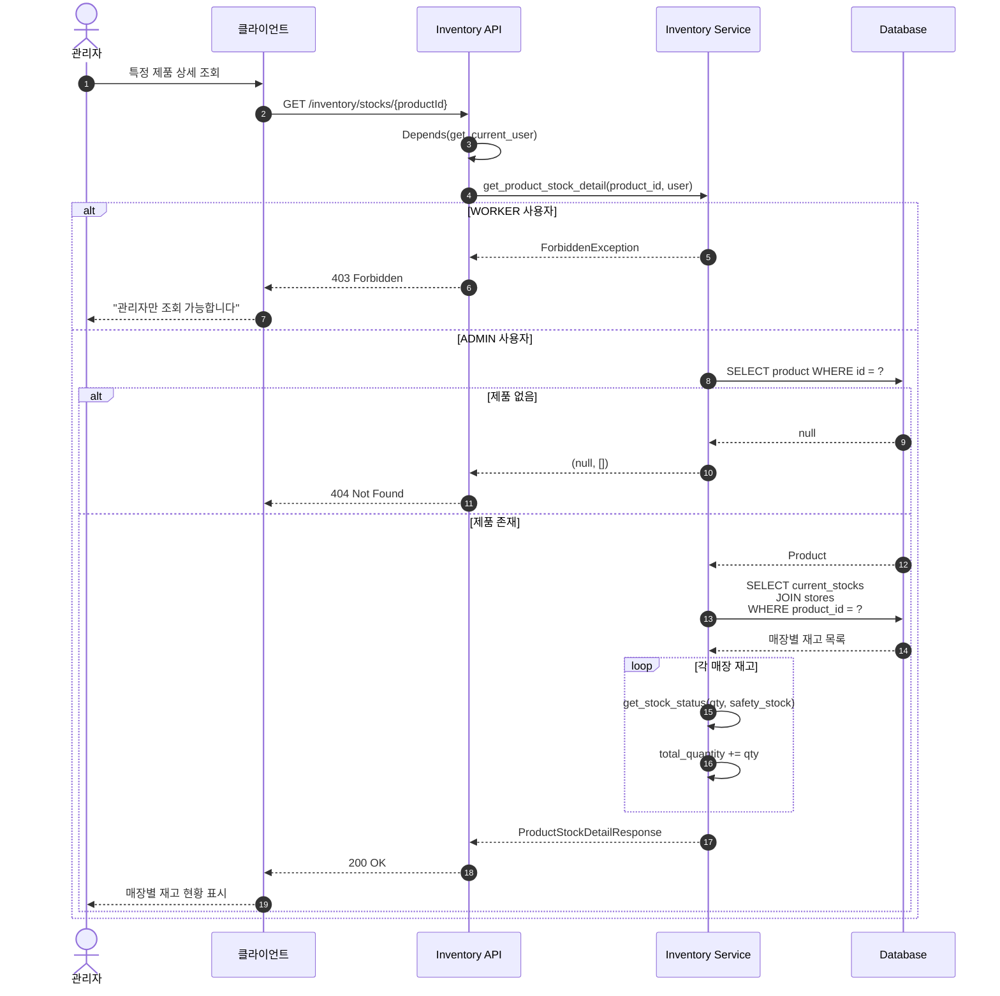
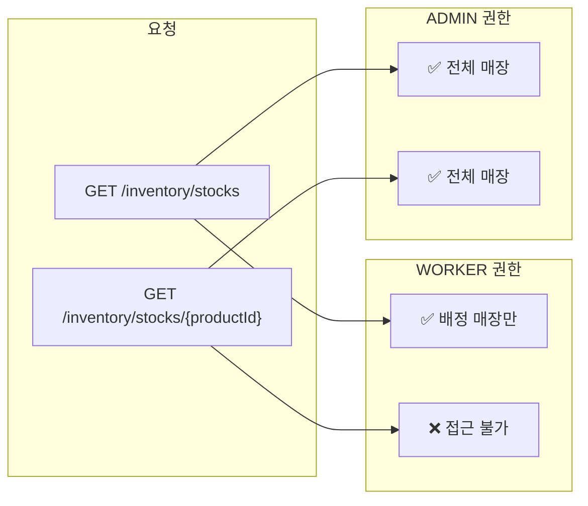

# 재고 (Inventory) 조회 플로우

## 현재고 목록 조회



---

## 재고 상태 계산 로직



**예시** (안전재고 = 10):
| 현재고 | 상태 |
|--------|------|
| 5 | 🔴 LOW |
| 15 | 🟡 NORMAL |
| 25 | 🟢 GOOD |

---

## 제품별 매장 재고 상세 조회 (ADMIN Only)



---

## 재고 조회 권한 매트릭스



---

## 현재고 테이블 구조 (current_stocks)

복합 PK를 사용하여 제품-매장 조합당 하나의 레코드만 존재합니다.

| 컬럼 | 타입 | 설명 |
|------|------|------|
| `product_id` | UUID PK, FK | 제품 ID |
| `store_id` | UUID PK, FK | 매장 ID |
| `quantity` | INTEGER | 현재 재고 수량 |
| `last_alerted_at` | TIMESTAMP | 마지막 안전재고 알림 시간 |
| `updated_at` | TIMESTAMP | 마지막 업데이트 시간 |

```sql
-- 현재고 빠른 조회를 위한 인덱스
CREATE INDEX idx_current_stock_store ON current_stocks(store_id);
```
