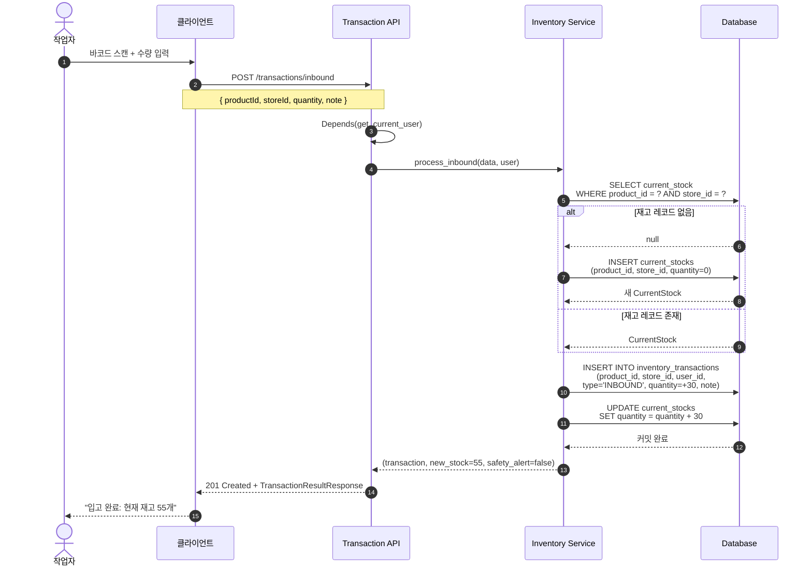
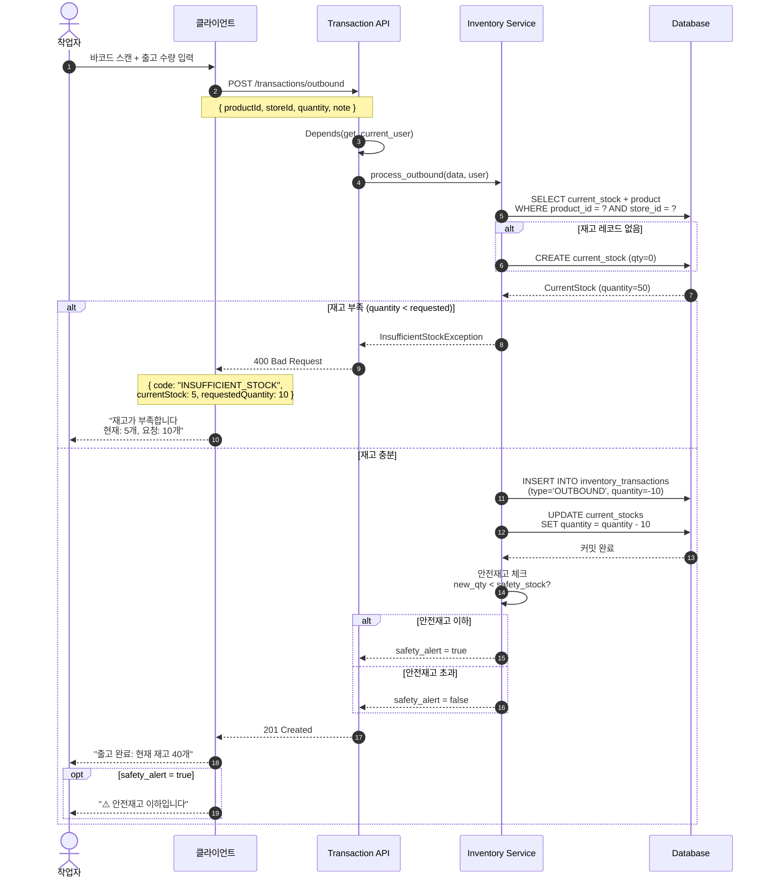
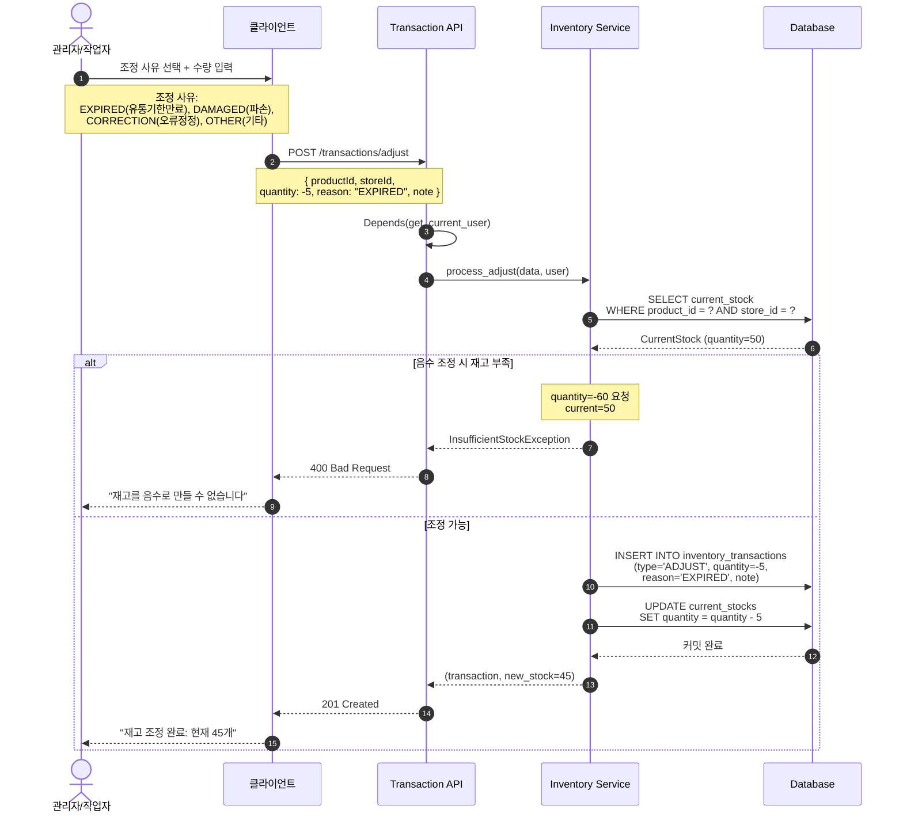
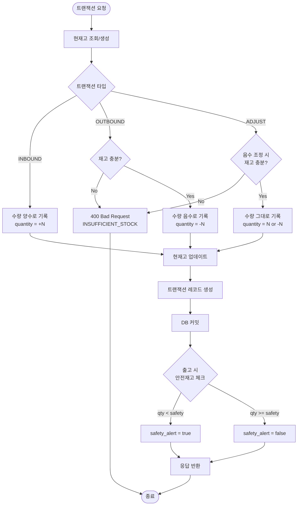
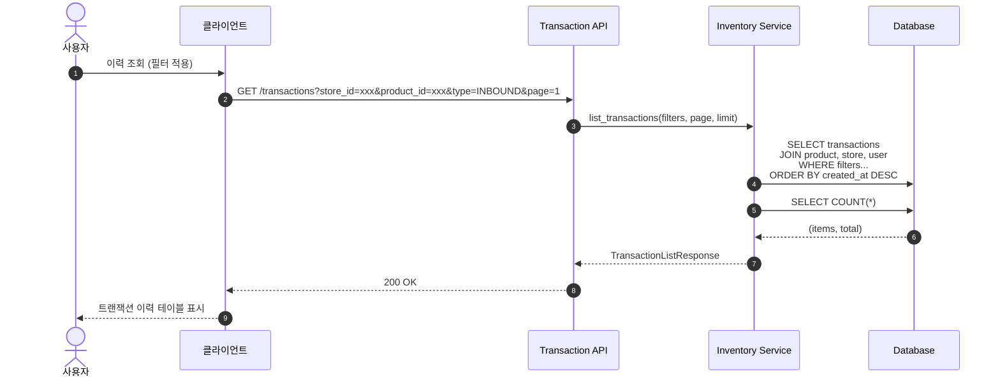

# 트랜잭션 (Transaction) 플로우

## 입고 처리 시퀀스

---

## 출고 처리 시퀀스

---

## 재고 조정 시퀀스

---

## 트랜잭션 처리 플로우차트

---

## 트랜잭션 이력 조회

---

## 트랜잭션 테이블 구조 (inventory_transactions)

Append-Only 패턴으로 모든 변경 이력을 보존합니다.

| 컬럼 | 타입 | 설명 |
|------|------|------|
| `id` | UUID PK | 고유 식별자 |
| `product_id` | UUID FK | 제품 |
| `store_id` | UUID FK | 매장 |
| `user_id` | UUID FK | 처리자 |
| `type` | ENUM | INBOUND, OUTBOUND, ADJUST |
| `quantity` | INTEGER | 변화량 (+/-) |
| `reason` | ENUM | EXPIRED, DAMAGED, CORRECTION, OTHER |
| `note` | TEXT | 비고 |
| `created_at` | TIMESTAMP | 트랜잭션 시간 |
| `synced_at` | TIMESTAMP | 동기화 시간 |
| `local_id` | UUID | 오프라인 생성 ID |
