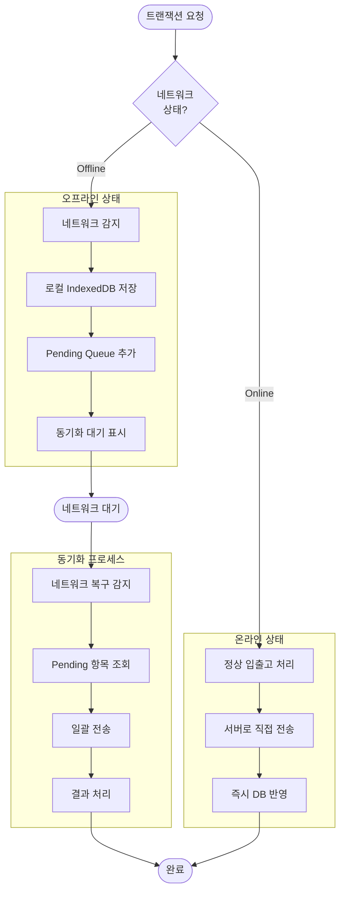
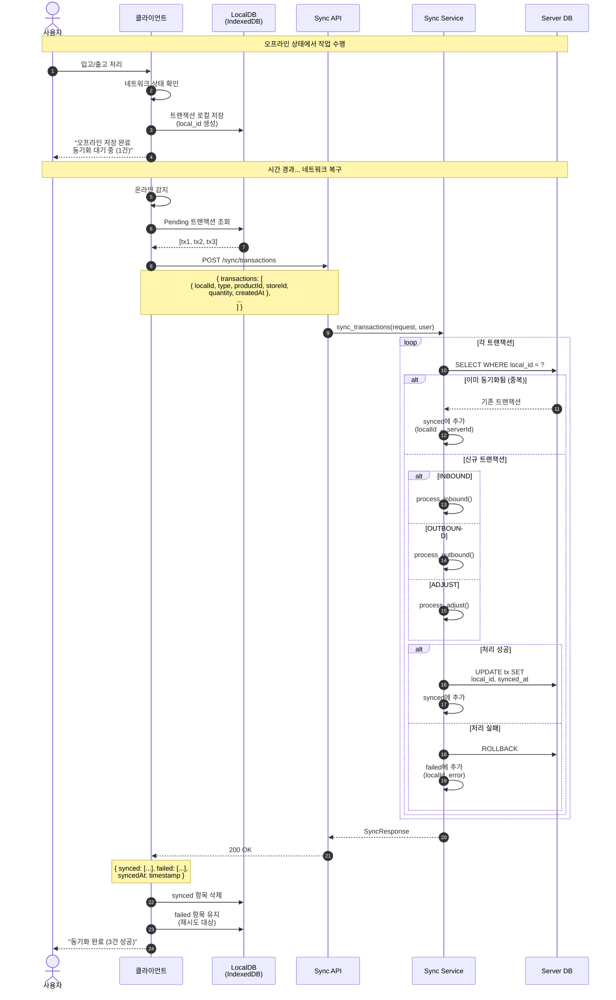
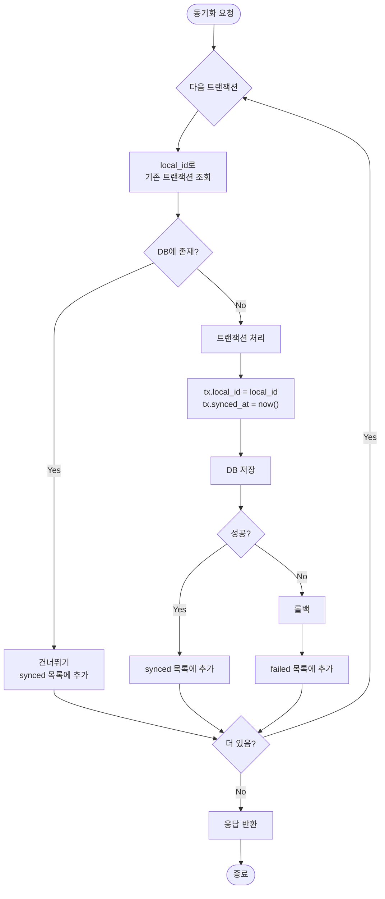
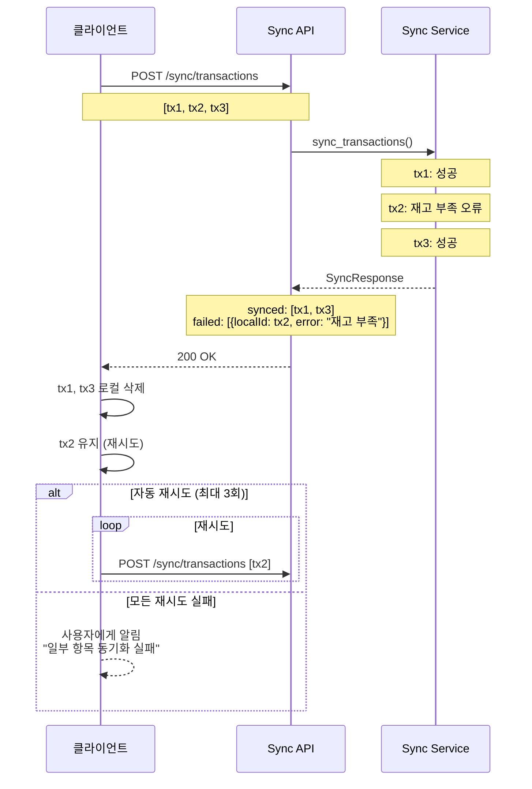
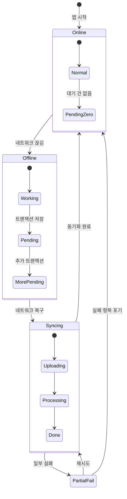

# 오프라인 동기화 (Sync) 플로우

## 오프라인 동작 개요



---

## 오프라인 트랜잭션 동기화 시퀀스



---

## 중복 방지 메커니즘



---

## 동기화 실패 처리



---

## 동기화 상태 표시 UI



---

## 동기화 요청/응답 스키마

### Request
```json
{
  "transactions": [
    {
      "localId": "uuid-client-generated",
      "type": "INBOUND | OUTBOUND | ADJUST",
      "productId": "uuid",
      "storeId": "uuid",
      "quantity": 30,
      "reason": "EXPIRED",  // ADJUST인 경우만
      "note": "비고",
      "createdAt": "2024-01-15T09:30:00Z"
    }
  ]
}
```

### Response
```json
{
  "synced": [
    { "localId": "...", "serverId": "uuid-server-generated" }
  ],
  "failed": [
    { "localId": "...", "error": "재고가 부족합니다" }
  ],
  "syncedAt": "2024-01-15T10:00:00Z"
}
```
