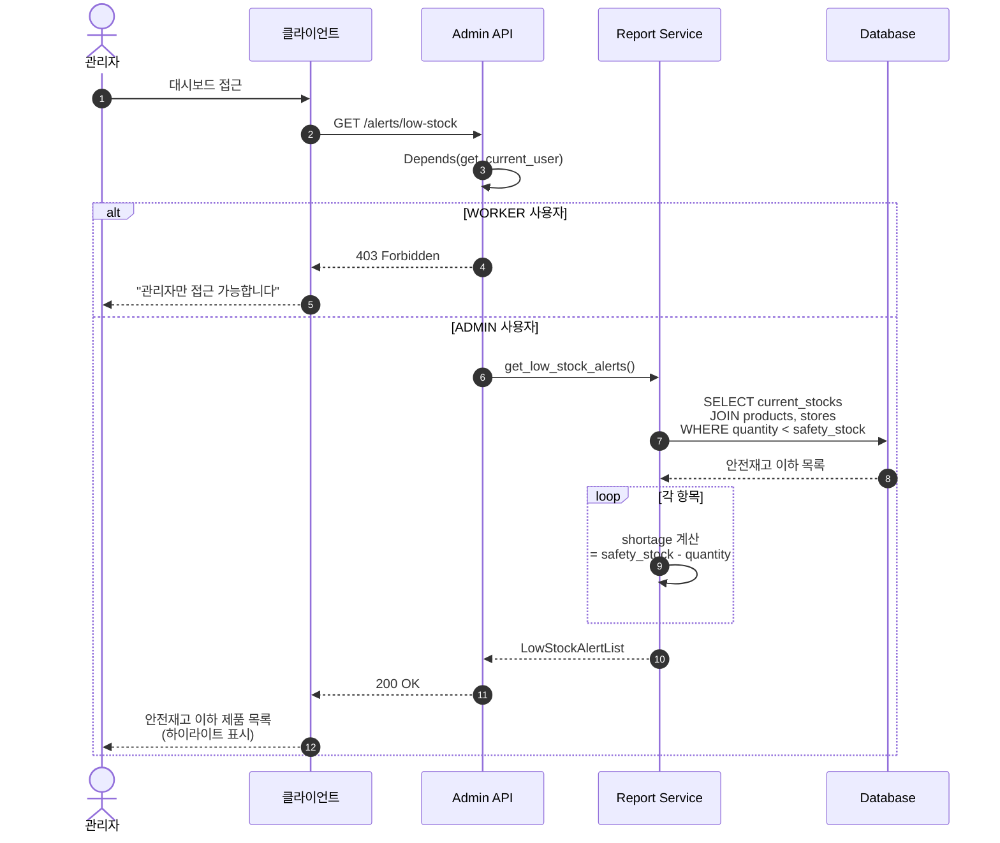
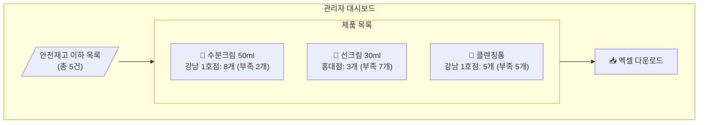
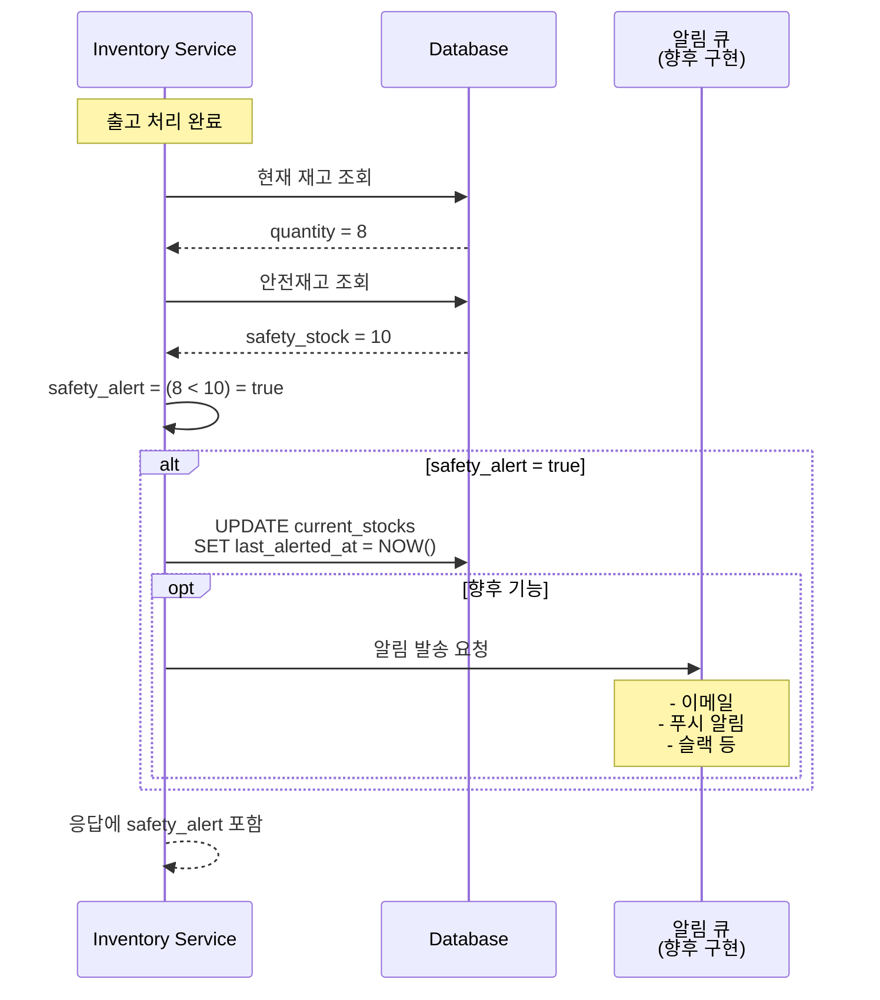

# 관리자 (Admin) 기능 플로우

## 안전재고 이하 알림 조회



---

## 안전재고 알림 대시보드 뷰



---

## 엑셀 내보내기 플로우

```mermaid
sequenceDiagram
    autonumber
    actor Admin as 관리자
    participant Client as 클라이언트
    participant API as Admin API
    participant Service as Report Service
    participant DB as Database

    Admin->>Client: "엑셀 다운로드" 클릭
    Client->>API: GET /exports/low-stock
    
    API->>API: Depends(get_current_user)
    
    alt 권한 없음
        API-->>Client: 403 Forbidden
    else ADMIN 확인
        API->>Service: export_low_stock_excel()
        
        Service->>DB: SELECT 안전재고 이하 목록
        DB-->>Service: 데이터
        
        Service->>Service: Excel 파일 생성<br/>(openpyxl/xlsxwriter)
        
        Service-->>API: Excel 바이트 스트림
        
        API-->>Client: Content-Type:<br/>application/vnd.openxmlformats-...<br/>Content-Disposition:<br/>attachment; filename="low_stock_YYYYMMDD.xlsx"
        
        Client-->>Admin: 파일 다운로드 시작
    end
```

---

## 권한 체크 플로우차트

```mermaid
flowchart TD
    Start([관리자 API 요청]) --> Auth{인증됨?}
    
    Auth -->|No| 401[401 Unauthorized]
    Auth -->|Yes| GetRole[사용자 역할 확인]
    
    GetRole --> CheckAdmin{role == ADMIN?}
    
    CheckAdmin -->|No| 403[403 Forbidden<br/>"Only ADMIN can access"]
    CheckAdmin -->|Yes| Process[요청 처리]
    
    Process --> Success[200 OK]
    
    401 --> End([종료])
    403 --> End
    Success --> End
```

---

## 안전재고 알림 트리거

출고 처리 시 자동으로 안전재고 체크가 수행됩니다.



---

## 관리자 전용 API 목록

| 엔드포인트 | 메서드 | 설명 | 응답 |
|------------|--------|------|------|
| `/alerts/low-stock` | GET | 안전재고 이하 목록 | JSON |
| `/exports/low-stock` | GET | 안전재고 이하 엑셀 | Excel 파일 |
| `/inventory/stocks/{productId}` | GET | 제품별 전체 매장 재고 | JSON |
| `/products` | POST | 신규 제품 등록 | JSON |
| `/products/generate-barcode` | POST | 내부 바코드 생성 | JSON |

---

## 안전재고 알림 응답 스키마

```json
{
  "success": true,
  "data": [
    {
      "product": {
        "id": "uuid",
        "name": "수분크림 50ml",
        "safetyStock": 10
      },
      "store": {
        "id": "uuid",
        "name": "강남 1호점"
      },
      "currentStock": 8,
      "shortage": 2
    }
  ]
}
```
