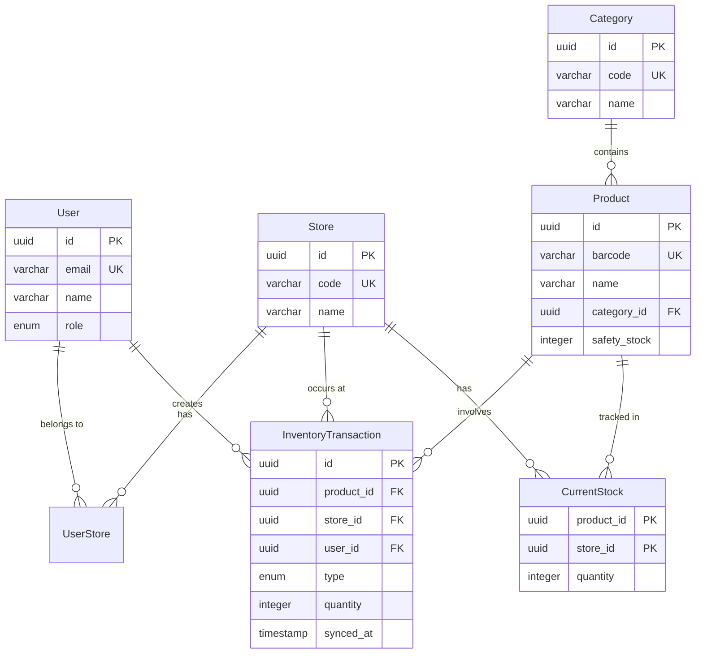

# ERD (Entity Relationship Diagram)

## 엔티티 목록

| 엔티티 | 설명 | 특징 |
|--------|------|------|
| User | 시스템 사용자 | WORKER/ADMIN 역할 구분 |
| Store | 매장/창고 | 재고 보관 장소 |
| UserStore | 사용자-매장 연결 | N:M 관계 해소 |
| Category | 제품 카테고리 | SK, MU, HC 등 |
| Product | 제품 마스터 | 바코드, 안전재고 포함 |
| InventoryTransaction | 재고 이동 원장 | Append-Only |
| CurrentStock | 현재고 캐시 | 빠른 조회용 |

---

## 관계 매트릭스

| 관계 | 유형 | 설명 |
|------|------|------|
| User - Store | N:M | UserStore로 연결 |
| Category - Product | 1:N | 카테고리당 다수 제품 |
| Product - InventoryTransaction | 1:N | 제품당 다수 트랜잭션 |
| Store - InventoryTransaction | 1:N | 매장당 다수 트랜잭션 |
| User - InventoryTransaction | 1:N | 사용자당 다수 트랜잭션 |
| Product + Store - CurrentStock | 1:1 | 복합키 |

---

## 테이블 상세

### users

| 컬럼 | 타입 | 제약조건 | 설명 |
|------|------|----------|------|
| id | UUID | PK | 고유 식별자 |
| email | VARCHAR(255) | UNIQUE, NOT NULL | 로그인 이메일 |
| password_hash | VARCHAR(255) | NOT NULL | 암호화된 비밀번호 |
| name | VARCHAR(100) | NOT NULL | 사용자 이름 |
| role | ENUM | NOT NULL, DEFAULT 'WORKER' | WORKER, ADMIN |
| is_active | BOOLEAN | NOT NULL, DEFAULT true | 활성화 여부 |
| created_at | TIMESTAMP | NOT NULL | 가입일 |
| updated_at | TIMESTAMP | | 수정일 |

### stores

| 컬럼 | 타입 | 제약조건 | 설명 |
|------|------|----------|------|
| id | UUID | PK | 고유 식별자 |
| code | VARCHAR(20) | UNIQUE, NOT NULL | 매장 코드 (STORE-001) |
| name | VARCHAR(100) | NOT NULL | 매장명 |
| address | VARCHAR(500) | | 주소 |
| phone | VARCHAR(20) | | 전화번호 |
| is_active | BOOLEAN | NOT NULL, DEFAULT true | 활성화 여부 |
| created_at | TIMESTAMP | NOT NULL | 등록일 |
| updated_at | TIMESTAMP | | 수정일 |

### user_stores

| 컬럼 | 타입 | 제약조건 | 설명 |
|------|------|----------|------|
| user_id | UUID | PK, FK | users.id 참조 |
| store_id | UUID | PK, FK | stores.id 참조 |
| assigned_at | TIMESTAMP | NOT NULL | 배정일 |

### categories

| 컬럼 | 타입 | 제약조건 | 설명 |
|------|------|----------|------|
| id | UUID | PK | 고유 식별자 |
| code | VARCHAR(10) | UNIQUE, NOT NULL | 카테고리 코드 |
| name | VARCHAR(50) | NOT NULL | 카테고리명 |
| sort_order | INTEGER | NOT NULL, DEFAULT 0 | 정렬 순서 |
| created_at | TIMESTAMP | NOT NULL | 등록일 |

**카테고리 코드**:
- SK: 스킨케어
- MU: 메이크업
- HC: 헤어케어
- BD: 바디케어
- FR: 향수
- ET: 기타

### products

| 컬럼 | 타입 | 제약조건 | 설명 |
|------|------|----------|------|
| id | UUID | PK | 고유 식별자 |
| barcode | VARCHAR(50) | UNIQUE, NOT NULL | 바코드 |
| name | VARCHAR(200) | NOT NULL | 제품명 |
| category_id | UUID | FK, NOT NULL | categories.id 참조 |
| safety_stock | INTEGER | NOT NULL, DEFAULT 10 | 안전재고 임계값 |
| image_url | VARCHAR(500) | | 제품 이미지 URL |
| memo | TEXT | | 메모 |
| is_active | BOOLEAN | NOT NULL, DEFAULT true | 활성화 여부 |
| created_at | TIMESTAMP | NOT NULL | 등록일 |
| updated_at | TIMESTAMP | | 수정일 |

### inventory_transactions

| 컬럼 | 타입 | 제약조건 | 설명 |
|------|------|----------|------|
| id | UUID | PK | 고유 식별자 |
| product_id | UUID | FK, NOT NULL | products.id 참조 |
| store_id | UUID | FK, NOT NULL | stores.id 참조 |
| user_id | UUID | FK, NOT NULL | users.id 참조 |
| type | ENUM | NOT NULL | INBOUND, OUTBOUND, ADJUST |
| quantity | INTEGER | NOT NULL | 변화량 (+/-) |
| reason | ENUM | | EXPIRED, DAMAGED, CORRECTION, OTHER |
| note | TEXT | | 비고 |
| created_at | TIMESTAMP | NOT NULL | 트랜잭션 시간 |
| synced_at | TIMESTAMP | | 서버 동기화 시간 |

**설계 포인트**:
- quantity는 항상 변화량 저장
- 입고: +30 (양수)
- 출고: -10 (음수)
- 조정(폐기): -5 (음수)
- reason은 type이 ADJUST일 때만 필수

### current_stocks

| 컬럼 | 타입 | 제약조건 | 설명 |
|------|------|----------|------|
| product_id | UUID | PK, FK | products.id 참조 |
| store_id | UUID | PK, FK | stores.id 참조 |
| quantity | INTEGER | NOT NULL, DEFAULT 0 | 현재 재고 수량 |
| last_alerted_at | TIMESTAMP | | 마지막 안전재고 알림 시간 |
| updated_at | TIMESTAMP | NOT NULL | 마지막 업데이트 시간 |

---

## 인덱스

```sql
-- 바코드 검색 (가장 빈번)
CREATE INDEX idx_product_barcode ON products(barcode);

-- 트랜잭션 조회
CREATE INDEX idx_transaction_store_product ON inventory_transactions(store_id, product_id);
CREATE INDEX idx_transaction_created_at ON inventory_transactions(created_at DESC);

-- 현재고 조회
CREATE INDEX idx_current_stock_store ON current_stocks(store_id);
```

---

## Mermaid ERD



---

## dbdiagram.io 코드

```
Project DoneDone {
  database_type: 'PostgreSQL'
}

Enum user_role {
  WORKER
  ADMIN
}

Enum transaction_type {
  INBOUND
  OUTBOUND
  ADJUST
}

Enum adjust_reason {
  EXPIRED
  DAMAGED
  CORRECTION
  OTHER
}

Table users {
  id uuid [pk]
  email varchar(255) [unique, not null]
  password_hash varchar(255) [not null]
  name varchar(100) [not null]
  role user_role [not null, default: 'WORKER']
  is_active boolean [not null, default: true]
  created_at timestamp [not null]
  updated_at timestamp
}

Table stores {
  id uuid [pk]
  code varchar(20) [unique, not null]
  name varchar(100) [not null]
  address varchar(500)
  phone varchar(20)
  is_active boolean [not null, default: true]
  created_at timestamp [not null]
  updated_at timestamp
}

Table user_stores {
  user_id uuid [ref: > users.id]
  store_id uuid [ref: > stores.id]
  assigned_at timestamp [not null]

  indexes {
    (user_id, store_id) [pk]
  }
}

Table categories {
  id uuid [pk]
  code varchar(10) [unique, not null]
  name varchar(50) [not null]
  sort_order int [not null, default: 0]
  created_at timestamp [not null]
}

Table products {
  id uuid [pk]
  barcode varchar(50) [unique, not null]
  name varchar(200) [not null]
  category_id uuid [not null, ref: > categories.id]
  safety_stock int [not null, default: 10]
  image_url varchar(500)
  memo text
  is_active boolean [not null, default: true]
  created_at timestamp [not null]
  updated_at timestamp
}

Table inventory_transactions {
  id uuid [pk]
  product_id uuid [not null, ref: > products.id]
  store_id uuid [not null, ref: > stores.id]
  user_id uuid [not null, ref: > users.id]
  type transaction_type [not null]
  quantity int [not null]
  reason adjust_reason
  note text
  created_at timestamp [not null]
  synced_at timestamp
}

Table current_stocks {
  product_id uuid [ref: > products.id]
  store_id uuid [ref: > stores.id]
  quantity int [not null, default: 0]
  last_alerted_at timestamp
  updated_at timestamp [not null]

  indexes {
    (product_id, store_id) [pk]
  }
}
```